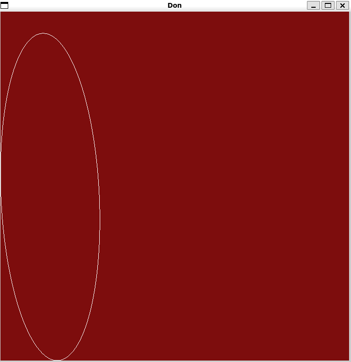
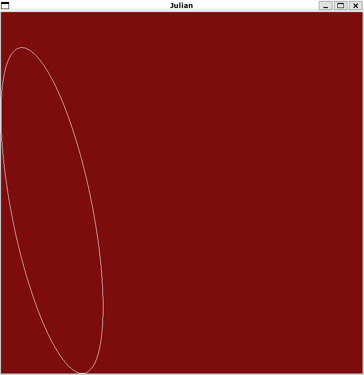

# Haskell-Visualisation-Project
## Fourier Transform of 

Contributors:
 - Arin Mukhopadhyay
 - Tony Zha

## Original Idea

The inspiration of this project is from the video of 3Blue1Brown explaining the idea of Fourier Series. As he said, Fourier Series could basically generate any line of loop by steps, which has several nice properties when doing mathematics calculation.

The idea of this project is to implement that into Haskell and using our own image, our two lecture professors, Don and Julian

## Basic Mechanisms

The general mechanism is to use discrete serialized data points to generate fourier series and draw it on the plane. The original function of fourier transform was

$$c(n)=\int^1_0f(t)e^{-2\pi nit}dt$$

By some approximation and assuming the curve is tracing through different points on plane linearly, we get:

$$c(n)=\sum_{j=0}^m p(i) e^{-2\pi n i (j/m)}\frac{1}{m}$$

where $f(x)$ is representing the position of the $i$ th edge and could be get by tracing the points on image and save as complex numbers

## User Guide

1. Install GLUT by using cabal install --lib GLUT
1. go to the folder containing Fourier_Transform.hs
1. open command line and type ghci
1. enable GLUT by using :set -package GLUT
1. type main to start generating the image
1. Play around with the constant! (numOfFourierTerms and numOfSteps at the beginning of the file)
(Draw different set of points by change to the other traced_points)

## Preview of Results

## Notes:
Clone the Entire Repo.
May encounter errors if glut32.dll is not present in the same directory as rest of the files.

Use GHCI Version 8.6.5.
Install GLUT via Cabal.

Everything else should be inside the file itself.
